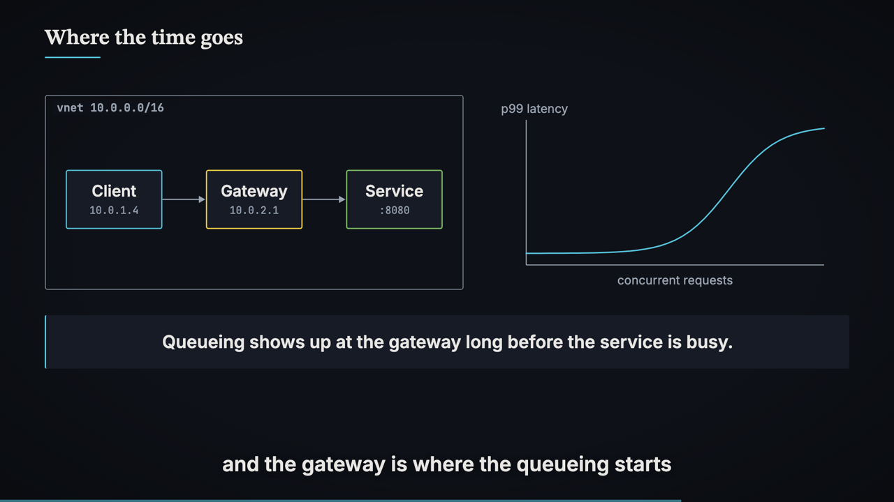
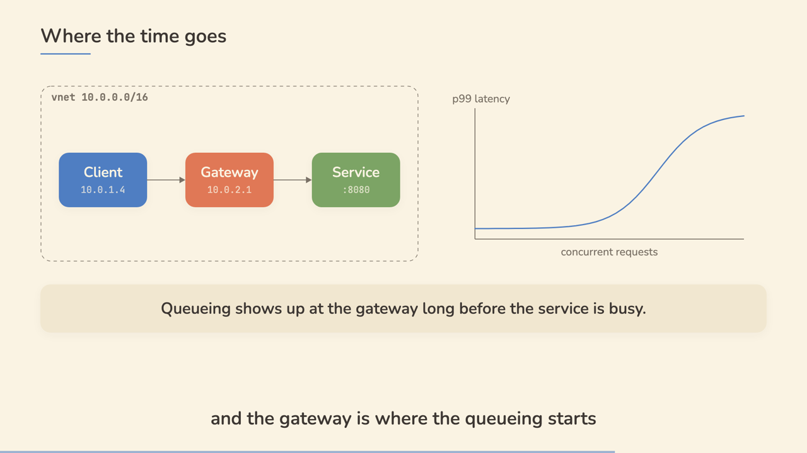
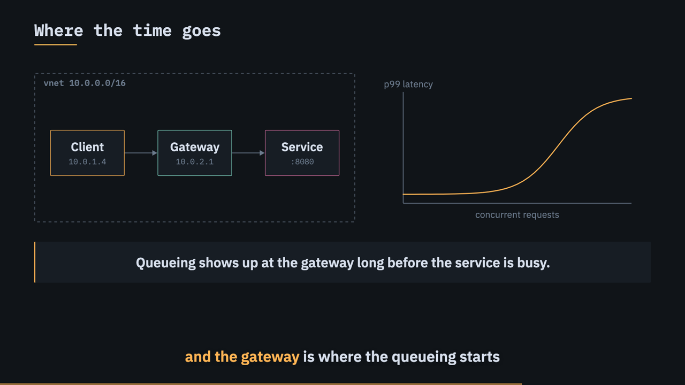
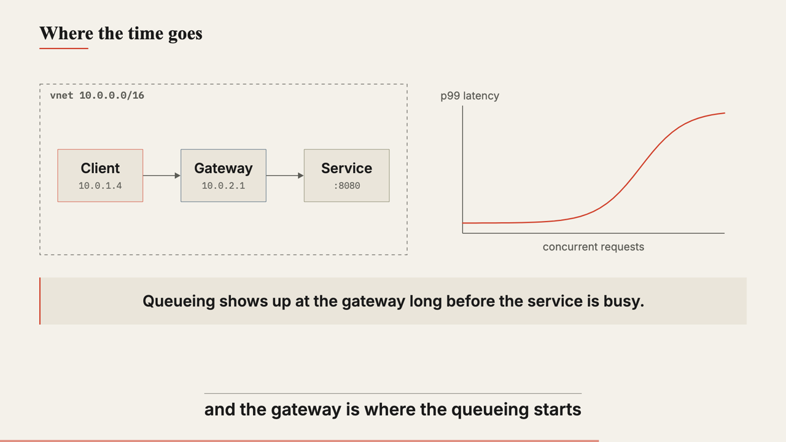

# remotion-tutorial

A Claude Code skill that turns a topic into a narrated technical tutorial
video: Remotion-rendered animation in the visual language of hand-crafted
math channels, an Azure neural voiceover with word-accurate burned-in
subtitles, and an exported .srt. Built for math and computer science
explainers.

What the skill enforces:

- A spoken-word narration script (through-line, three-beat explanations, one
  analogy per hard idea, plain recap endings) that is checked against a list
  of AI-writing tells before any audio is generated.
- Content grounded in official sources, with a per-video `sources.md` and a
  licensing check before any external material is used
  (`references/grounding.md`).
- Four aesthetic presets (`chalkboard`, `paper`, `terminal`, `print`) driven
  entirely by design tokens, with hard anti-slop rules: no gradients, no
  glassmorphism, no emoji, motion only when the narration introduces
  something.
- Voiceover through Azure Speech batch synthesis via the az CLI, which also
  returns per-word timestamps; visual reveals are keyed to the exact frame a
  word is spoken.
- A mandatory two-pass aesthetic review: rendered stills are visually
  inspected against a checklist, then re-inspected at shifted timestamps with
  a layout-audit overlay that flags overlaps and margin violations in red.
- Per-chapter renders concatenated losslessly, so a 60-minute video (the
  default duration) is built from retryable units.

## Presets

The same scene rendered in each of the four presets. Title cards and the
scene that generates these are in [`samples/`](samples).

| chalkboard — math and theory | paper — friendly ELI5 and metaphor |
|---|---|
|  |  |
| **terminal** — systems, infra, code | **print** — history, proofs, editorial |
|  |  |

## Install

```bash
git clone https://github.com/kokko-ng/remotion-tutorial.git ~/.claude/skills/remotion-tutorial
```

Then ask Claude Code for a tutorial video ("make me a 20 minute tutorial
video on eigenvalues, chalkboard style").

## Requirements

- Node 18+, ffmpeg, python3 (stdlib only; no pip packages)
- az CLI logged into a subscription with a Speech or AIServices resource
- Remotion is installed per video project by the skill. Note Remotion's
  license: free for individuals and companies of up to 3 people, paid company
  license above that (https://remotion.dev/license). This repo does not grant
  or include a Remotion license.

## Layout

- `SKILL.md` — the workflow the agent follows
- `references/` — narration voice, humanizer rules, aesthetic presets,
  review checklist, Azure TTS pipeline, grounding and licensing
- `scripts/` — voiceover generation, subtitle building, review stills,
  chapter concat
- `template/` — the complete Remotion project each video starts from
- `samples/` — one still per preset and the showcase scene that renders them
- `examples/` — briefs, narrations, and scene code of the three demo videos
  (ELI5 Azure Networking, Mechanistic Interpretability, System Design in
  Azure), one per aesthetic preset

Demo videos are attached to the GitHub release rather than committed.

## Credits

The narration and language rules adapt two skills: a technical-audiobook
writing skill and the MIT-licensed
[humanizer](https://github.com/blader/humanizer) skill, which is based on
Wikipedia's "Signs of AI writing" guide. The aesthetic presets are inspired
by, and not copied from, 3Blue1Brown and Primer; no assets from either
channel are used.
